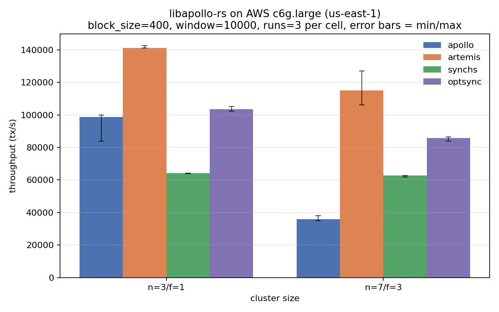
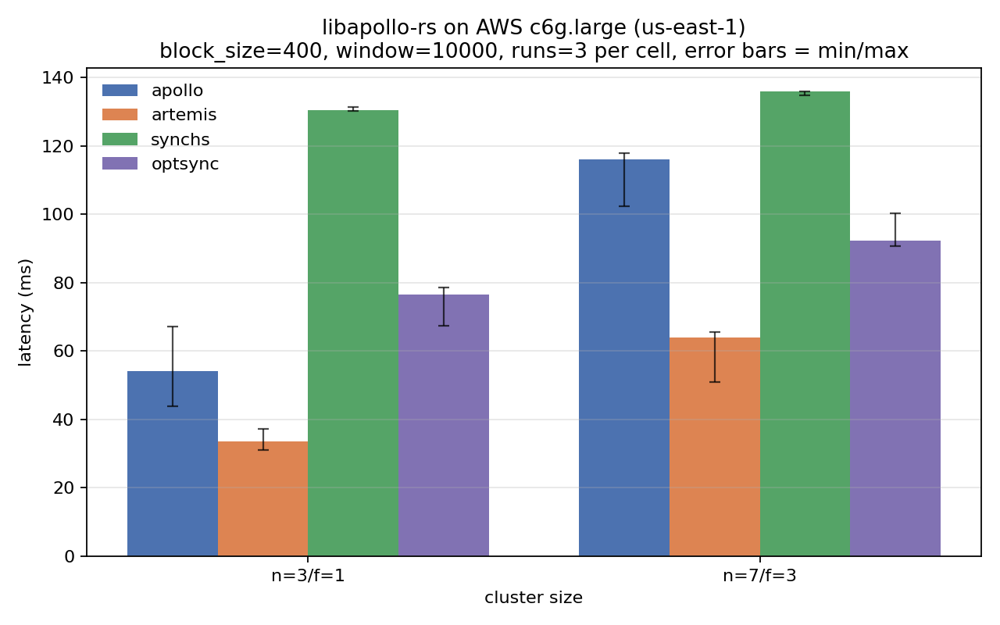

# libapollo-rs

Rust implementations of four BFT consensus protocols:

| Crate               | Protocol         | Reference                                             |
| ------------------- | ---------------- | ----------------------------------------------------- |
| `consensus/apollo`  | Apollo           | [FC 2023 paper](https://github.com/libdist-rs/libchatter-rs/releases/tag/apollo-fc2023-artifact) |
| `consensus/artemis` | Artemis          |                                                       |
| `consensus/synchs`  | Sync HotStuff    |                                                       |
| `consensus/optsync` | Opt Sync         |                                                       |

This repository is the active-development home for these protocols. The
frozen FC 2023 artifact (same protocols, older dependencies) lives at
[`libdist-rs/libchatter-rs`](https://github.com/libdist-rs/libchatter-rs)
tag `apollo-fc2023-artifact`.

## Status

Migration in progress from libchatter-rs onto the modern successor crates:

- [x] Import from libchatter-rs@apollo-fc2023-artifact
- [ ] [`libcrypto-rs`](https://github.com/libdist-rs/libcrypto-rs) -- replaces in-tree `crypto/`
- [ ] [`libnet-rs`](https://github.com/libdist-rs/libnet-rs) -- replaces in-tree `net/`
- [ ] [`libmempool-rs`](https://github.com/libdist-rs/libmempool-rs) -- replaces the per-protocol transaction pool
- [ ] [`libstorage-rs`](https://github.com/libdist-rs/libstorage-rs) -- replaces the per-protocol in-memory block store

Each migration step is a focused commit validated end-to-end against the
stress-test harness.

## Building

```sh
cargo build --release
```

## Running the stress test

```sh
cargo build --release
./target/release/stress-test
```

The harness spawns N-node clusters on loopback for each of the four
protocols, drives a client load, and prints throughput + latency in the
same format as
[`libnet-rs`'s stress test](https://github.com/libdist-rs/libnet-rs).
The canonical baseline lives in [`baseline_results.txt`](baseline_results.txt).

## Multi-VM benchmarks (AWS)

The loopback stress-test is a poor proxy for real performance: N node
processes contend for one machine's CPU, and the throughput ceiling on
my M1 Pro sits at ~15-40 k tx/s depending on protocol. Moving the same
binaries onto 7 × `c6g.large` (one node per VM) lifts that by 2-8×.
Artemis specifically — which is *latency-pipelined* — benefits the most:





| protocol | n=3/f=1 (tx/s) | n=3/f=1 (ms) | n=7/f=3 (tx/s) | n=7/f=3 (ms) |
| --- | ---: | ---: | ---: | ---: |
| **Artemis** | **141 k** | **33** | **115 k** | **64** |
| Opt Sync | 104 k | 77 | 86 k | 92 |
| Apollo | 99 k | 54 | 36 k | 116 |
| Sync HotStuff | 64 k | 130 | 63 k | 136 |

Medians across 3 runs per cell; error bars on the plots show min/max.
Raw DP[Throughput] / DP[Latency] lines from every client run are
preserved under `scripts/state/results/<stamp>/` for audit.

The numbers land where the papers predict: Artemis's UCR chained-voting
has the fewest round-trips per commit, so on a real network it beats
Opt Sync (which was ahead on loopback, because Opt Sync is timer-driven
and less sensitive to per-syscall overhead).

### Reproducing the benchmark

Prerequisites:

* AWS account with EC2 access (`ec2:RunInstances`, `ec2:DescribeImages`,
  SG/VPC/keypair create/delete). No `ssm:GetParameter` needed.
* `aws` CLI authenticated in the target region.
* Python 3.11+, `rsync`, `ssh`.

Steps (from the repo root):

```sh
# One-time setup
python3 -m venv scripts/venv
scripts/venv/bin/pip install -r scripts/requirements.txt
cd scripts
source venv/bin/activate

# Provision 7 × c6g.large in us-east-1a. Writes key + instance IDs
# into `scripts/state/aws.json`. ~3-5 min. $0.48/hr from here.
fab provision

# Install Rust + build deps (clang, cmake, rocksdb, ...) in parallel.
fab install

# Sync the repo to node 0 and build the release binaries there;
# distribute them to the other 6. Takes ~15 min on c6g.large.
fab sync-src
fab build

# Full sweep: every (protocol, n:f) × runs times. Writes client.logs
# + parsed {throughput, latency} JSON under
# `scripts/state/results/<timestamp>-<tag>/`.
fab bench --runs 3 --configs 3:1,7:3 --tag main

# Parse the raw logs and render PNGs + summary CSV into `benchmarks/`.
fab plot

# Tear down all AWS resources tracked in state/aws.json.
fab teardown
```

Each command is idempotent-ish (rerunning `fab build` is a cargo
incremental build, `fab bench` writes to a new timestamped subdir).
Leaving a cell failed mid-sweep doesn't trigger auto-teardown —
the script explicitly preserves state so you can SSH in and debug,
then `fab teardown` when you're done.

Budget for a clean full sweep: ~60-90 minutes wall-clock, ~$0.50-$0.80.

### Adapting to your own workload

* Different instance type: `fab provision --instance-type m7g.medium`
  (any ARM AMI will work; `fab provision --region us-west-2` for a
  different region).
* Different block / workload size: `fab bench --block-size 1000
  --total-txs 200000 --window 20000 ...`.
* Different protocol sweep: `fab bench --protocols artemis,optsync
  --configs 3:1,7:3,15:7`.

The `fab` task list (`fab -l`) surfaces every step; `fab <task> --help`
documents each task's options.
